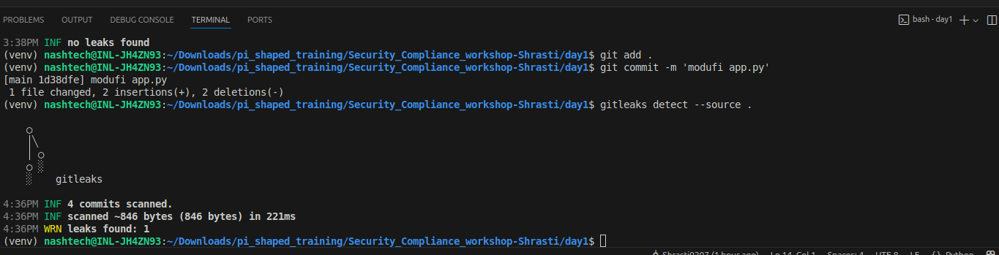
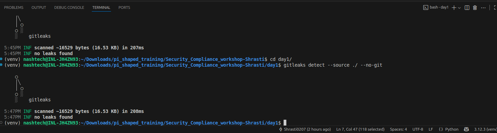
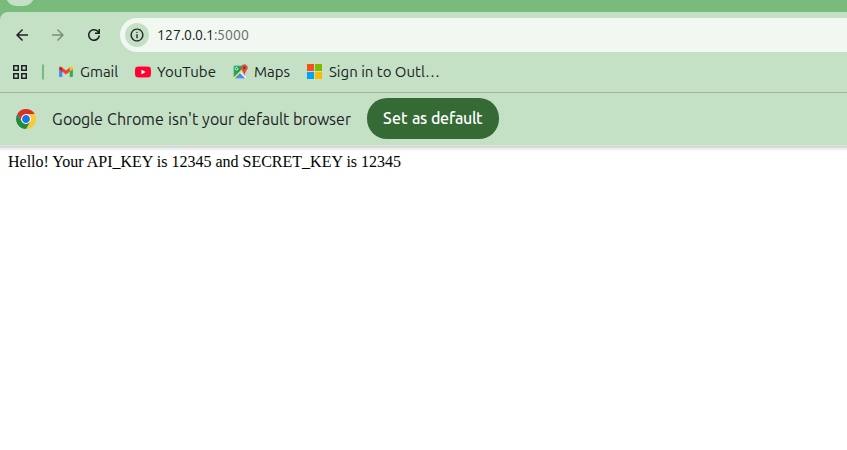

# DevSecOps Hands-On: Code Security & Shift-Left Practices - Shrasti Gupta

## Objective
Demonstrate understanding of **shift-left security principles** by scanning code for secrets, safely removing them, and deploying an application securely.

---

## Steps Taken

1. **Used Sample Code**  
   - Chose a simple application (Flask/Django/Node.js) for demonstration.  
   - Inserted a sample secret in the code for testing purposes.

2. **Gitleaks Setup & Configuration**  
   - Installed Gitleaks locally:  
   - Configured Gitleaks using default rules.  
   - Ran the scan on the repo:  
     ```bash
     gitleaks detect --source ./my-repo
     ```

3. **Screenshots of Gitleaks Scan**
   - **Before secret removal:**  
       
   - **After secret removal:**  
     

4. **Identify and Remove Secrets**  
   - Checked Gitleaks output for detected secrets.  
   - Removed hardcoded secrets and replaced them with environment variables:
   - Verified `.env` file is in `.gitignore` to avoid accidental commits.

5. **Re-run Gitleaks**  
   - Verified that the repository is clean and no secrets are detected.

6. **Deploy Application**  
   - Used Docker to build and run the application locally.
   - Built Docker image:
    ```bash
    docker build -t myapp .
    ```
   - Ran Docker container using .env
    ```
    docker run -d -p 5000:5000 --env-file .env myapp
    ```
   - Verified app in browser: 


---

## Findings

- Gitleaks detected hardcoded secrets (API_KEY) in the repo.  
- Fixes applied: removed secrets, used environment variables, and ensured `.env` files are ignored in Git.  

---

## Challenges Faced & Resolutions

| Challenge | Resolution |
|-----------|-----------|
| Secret detected in multiple files or commits | Identified and removed from all occurrences, used `.env` files |
| Ensuring `.env` not accidentally committed | Added `.env` to `.gitignore` and verified clean repo with Gitleaks |
| Understanding Gitleaks config & false positives | Used default rules and excluded non-sensitive files |

---

## Lessons Learned

- Early detection of secrets helps prevent potential security breaches in production.  
- Gitleaks is effective for scanning repos for hardcoded secrets.  
- Secrets should never be committed; always use secure storage methods.  
- Docker + `.env` files provide a secure way to inject secrets during deployment.  

---

## Core Concept Questions

### 1. What is shift-left security and why is it important?
- **Shift-left security** means identifying and addressing vulnerabilities **early in the SDLC** rather than in production.  
- Reduces cost, minimizes risk of breaches, and ensures safer deployments.

### 2. How does detecting secrets early in the CI/CD pipeline prevent production vulnerabilities?
- Prevents sensitive information like API keys, passwords, or tokens from reaching production.  
- Reduces the chance of leaks or misuse of secrets.

### 3. What strategies can be used to store secrets securely instead of hardcoding them?
- Environment variables  
- Secret management tools (e.g., Vault, AWS Secrets Manager)  
- Config files excluded from version control (`.gitignore`)

### 4. Describe a situation where a secret could still be exposed even after scanning, and how to prevent it.
- Secrets could still appear in logs, screenshots, old commits, or backups.  
- Prevention: clean commit history, monitor logs, rotate secrets regularly.

---

## Conclusion
Implementing **shift-left security** ensures early detection of vulnerabilities, safe handling of secrets, and secure deployment of applications.
