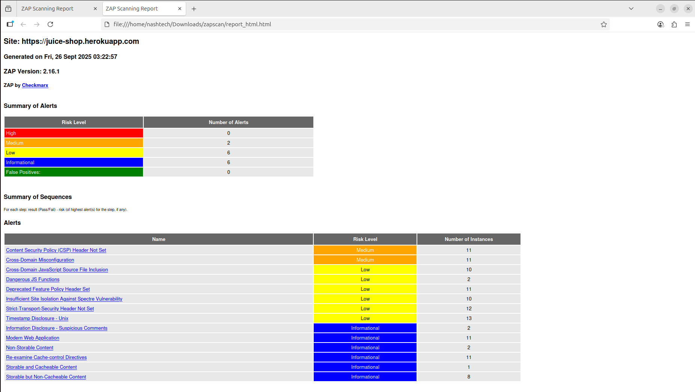

# Day 2 — OWASP ZAP: Detecting & Understanding Web Vulnerabilities

## Objective
The goal of this task is to integrate OWASP ZAP with a sample vulnerable application (OWASP Juice Shop) using GitHub Actions. The pipeline runs automatically on code push, generates a zap-report.html as an artifact, and helps identify security vulnerabilities for analysis and fixes.

## 1. Pull & run the target app (Juice Shop) locally
```bash
# pull the image (optional if you already pulled)
docker pull bkimminich/juice-shop:latest

# run the app as a background container
docker run -d --name juice -p 3000:3000 bkimminich/juice-shop:latest

# verify it is up (open in browser)
# http://localhost:3000
curl -sSf http://localhost:3000
```

---

## 2. What screenshot/report shows
Here is a screenshot of the summary section from the `report_html.html` generated by the pipeline.



In the screenshot I shared, the report summary shows:

- **High:** 0  
- **Medium:** **2**  
- **Low:** 6  
- **Informational:** 6  
- **False Positives:** 0

The two **Medium** alerts listed are:

1. **Content Security Policy (CSP) Header Not Set** — *Number of instances: 11*  
2. **Cross-Domain Misconfiguration** — *Number of instances: 11*


---

## 3. Short explanation + recommended fixes (per vulnerability)

### A. Content Security Policy (CSP) Header Not Set — **Medium**
**What it means:**  
The web app does not send a Content-Security-Policy header. Without CSP, an attacker has fewer constraints for injecting/ running malicious scripts (increases XSS risk).

**Recommended fix (high level):**
- Implement a Content-Security-Policy header appropriate for the app.
- Start with a restrictive policy and relax only as required by the app.
- Example (adapt to your resources and allowed domains):
```http
Content-Security-Policy: default-src 'self'; script-src 'self' https:; connect-src 'self' https:; img-src 'self' data: https:; object-src 'none'; base-uri 'self'; frame-ancestors 'none'; form-action 'self'; upgrade-insecure-requests;
```
**Steps:**
1. Identify which domains/scripts the app legitimately needs (CDNs, analytics, APIs).
2. Create a policy that allows only those sources.
3. Deploy as `Content-Security-Policy` header (or use `Content-Security-Policy-Report-Only` first to test).
4. Re-scan after deployment.

---

### B. Cross-Domain Misconfiguration — **Medium**
**What it means:**  
CORS or other cross-domain settings are configured too permissively (e.g., `Access-Control-Allow-Origin: *` while allowing credentials), or there’s another improper cross-domain policy that lets unintended origins interact with resources.

**Recommended fix (high level):**
- Restrict `Access-Control-Allow-Origin` to only trusted origins (do not use `*` if sending credentials).
- Explicitly set allowed headers/methods and only allow credentials when necessary.
- Example:
```http
Access-Control-Allow-Origin: https://your-frontend.example.com
Access-Control-Allow-Methods: GET, POST, OPTIONS
Access-Control-Allow-Headers: Content-Type, Authorization
Access-Control-Allow-Credentials: true   # only if truly needed
```
**Steps:**
1. Audit endpoints that return CORS headers.
2. Replace `*` with a whitelist of allowed origins.
3. Ensure the server validates `Origin` and only returns ACL headers when the origin is allowed.
4. Re-scan after changes.

---


## Core concept answers
### 1. What is the purpose of DAST and how does it complement other security testing methods?
-   DAST (Dynamic Application Security Testing) tests an application in its running state.
-   It simulates real-world attacker behavior by sending malicious requests to the app.
-   Heps identify vulnerabilities such as XSS, SQL Injection, authentication flaws, and misconfigurations.
### 2. Explain how XSS or SQL injection vulnerabilities can affect an application and its users.
-   **Cross-Site Scripting (XSS):**
    - Allows attackers to inject and execute malicious scripts in the user’s browser.
    - Can steal cookies, session tokens, or sensitive user data.
    - May lead to account hijacking, phishing attacks, or spreading malware.

-   **SQL Injection (SQLi):**
    - Exploits unsanitized input fields to run malicious SQL queries.
    - Attackers can read, modify, or delete data in the database.
    - Can bypass authentication, leading to unauthorized access.
    - May cause full data breaches and reputational loss.

### 3. Describe the steps you would take to fix the vulnerabilities detected in your ZAP scan.
-   **For SQL Injection:**
    - Use parameterized queries / prepared statements instead of string concatenation.
    - Implement strong input validation and sanitization.
    - Apply least privilege on database accounts.

-   **For XSS:**
    - Encode or escape user inputs before rendering in HTML/JS.
    - Use frameworks/libraries with built-in XSS protection.
    - Implement a strong Content Security Policy (CSP).

-   **General Fixes:**
    - Apply secure configuration (disable default accounts, enforce HTTPS).
    - Patch and update frameworks, libraries, and dependencies regularly.
    - Add proper error handling to avoid information leakage.

### 4. How does integrating ZAP scans into CI/CD pipelines support shift-left security practices?** 
-   Shift-left means integrating security earlier in the Software Development Lifecycle (SDLC).
-   Running automated ZAP scans in CI/CD ensures vulnerabilities are caught before production release.
-   Developers get fast feedback on security issues as part of build/test stages.
-   Reduces cost of fixing vulnerabilities by detecting them early.
