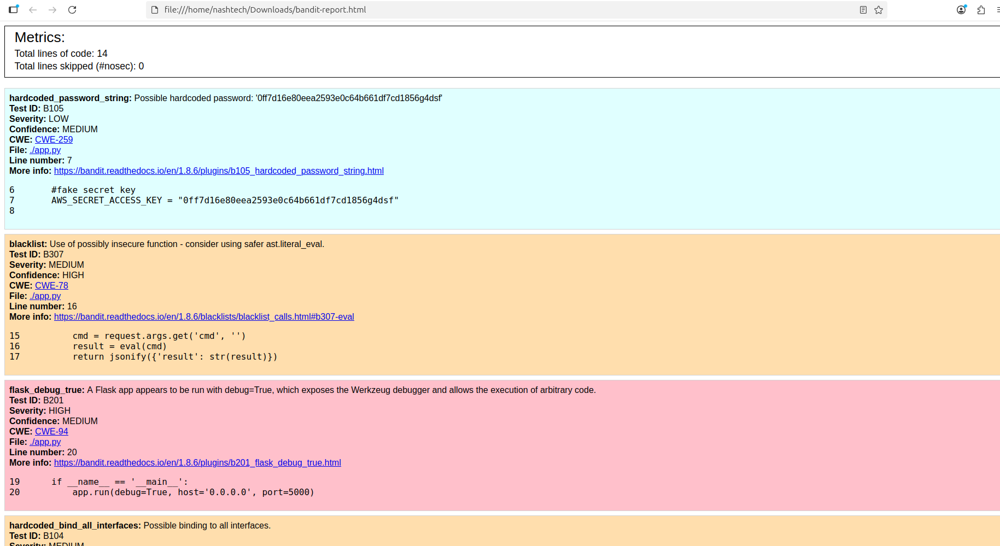
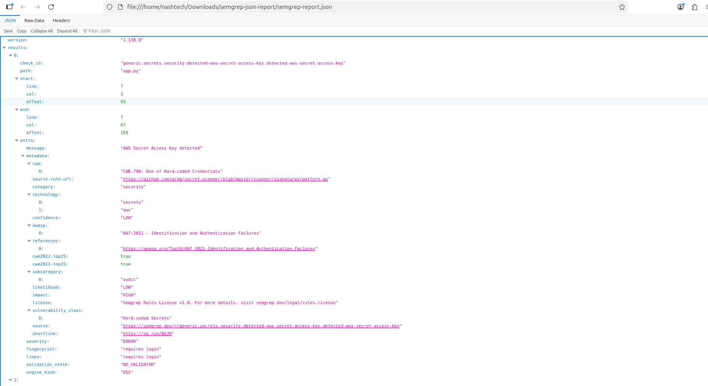

# Day 3 — Secure Coding Practices & Code Scanning

## Title

CI/CD-Based Secure Coding & Code Scanning with Bandit, Semgrep, Gitleaks & OWASP ZAP

## Objective

To integrate Bandit, Semgrep, Gitleaks, and OWASP ZAP into a GitHub Actions pipeline for detecting insecure coding practices, hardcoded secrets, and runtime vulnerabilities, and to practice fixing issues to improve code security.

---

## GitHub Actions CI/CD Integration

* A workflow `.github/workflows/security-scans.yml` was created to run on every push to the `main` branch.
* Stages:

  * **Bandit scan** → generates `bandit-report.html`.
  * **Semgrep scan** → generates `semgrep-report.json`.
  * **Gitleaks scan** → detects hardcoded secrets.
  * **OWASP ZAP scan (DAST)** → runs against the Flask app on `http://localhost:5000` and generates `zap-report.html`.
* All reports are saved as CI/CD artifacts for review.

---

## Screenshots / Artifacts

* **Bandit Report:** 
* **Semgrep Report:** 

---

## Vulnerabilities Found

### 1. Hardcoded Secret Key

* **Impact:**
  A hardcoded secret (`SECRET_KEY`) was found in `appVulnerable.py`. This can lead to **session hijacking** and other security issues if attackers gain access to the codebase, because the key is static and predictable.
* **Recommended Fix:**
  Remove hardcoded values from code. Instead, load secrets from **environment variables** or a **secrets manager**.

  ```python
  import os
  app.config['SECRET_KEY'] = os.environ.get('SECRET_KEY', 'dev-secret')
  ```

---

### 2. Use of `eval()`

* **Impact:**
  The application uses Python’s `eval()` on user input in `appVulnerable.py`. This is highly dangerous because an attacker can execute **arbitrary Python code**, potentially leading to **remote code execution (RCE)**.
* **Recommended Fix:**
  Avoid `eval()`. If you only need to safely evaluate literals (e.g., numbers, lists, dicts), use `ast.literal_eval()`.

  ```python
  import ast
  cmd = request.args.get('cmd', '')
  try:
      result = ast.literal_eval(cmd)
  except Exception:
      result = "Invalid input"
  ```

---

## Evidence of Fixing One Issue

* **Before:** `app.config['SECRET_KEY'] = 'hardcoded_secret_12345'` flagged by Bandit and Gitleaks.
* **After Fix:**

  ```python
  import os
  app.config['SECRET_KEY'] = os.environ.get('SECRET_KEY', 'dev-default-secret')
  ```
* **Result:** Re-running Bandit, Semgrep, and Gitleaks locally and in CI/CD showed the hardcoded secret issue was no longer flagged.

---

## Core Concept Questions

### 1. What is the difference between SAST, DAST, and secrets scanning, and why should all be part of a CI/CD pipeline?

* **SAST (Static Application Security Testing):** Analyzes source code for vulnerabilities before runtime (e.g., Bandit, Semgrep).
* **DAST (Dynamic Application Security Testing):** Tests the running application by simulating attacks (e.g., ZAP).
* **Secrets Scanning:** Detects exposed credentials in code repositories (e.g., Gitleaks).
* **Why all three:** They complement each other and provide defense-in-depth security coverage.

### 2. Why is storing secrets in code dangerous? What’s a secure alternative?

* **Danger:** Secrets in code may leak via version control, forks, or logs.
* **Secure Alternatives:** Use environment variables, secret managers (e.g., Vault, AWS Secrets Manager, GitHub Secrets).

### 3. How does adding these scans to a pipeline help enforce Shift-Left Security?

* Automates security testing early in the SDLC.
* Provides developers fast feedback before code reaches production.
* Reduces cost of fixing vulnerabilities by catching them early.

### 4. If a scan fails in your pipeline, what is the next step for a developer or DevOps engineer?

* Review the report.
* Triage whether the finding is valid or false positive.
* If valid: create an issue, fix in code, rotate secrets if necessary.
* Push fix → pipeline re-runs to validate improvements.

---
