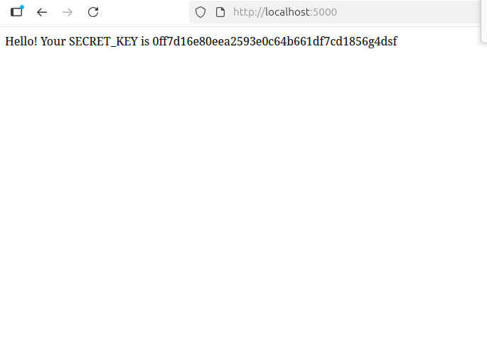

# CI/CD-Based DevSecOps Pipeline – Tools & Integrations

## Objective
Build a DevSecOps pipeline to automatically scan Python Flask applications for:  
- Insecure code  
- Vulnerable dependencies  
- Runtime vulnerabilities  

The pipeline uses **Bandit, Semgrep, Trivy, and OWASP ZAP** to detect issues and generate reports.

---

## Local Setup & Execution Steps
```bash
pip install -r requirements.txt
```

###  Run Flask App
```bash
python appVulnerable.py
```
**Runnable Application:** 

### Run Security Scans Locally

### 1. Bandit – Detect insecure code
Bandit scans your Python code for security issues such as hardcoded secrets or unsafe functions.

```bash
# Install Bandit
pip install bandit

# Run scan recursively on the project and generate an HTML report
bandit -r . -f html -o bandit-report.html

```

### 2. Semgrep – Detect insecure coding patterns
Semgrep detects unsafe coding patterns in your Python code.

```bash
# Install Semgrep
pip install semgrep

# Run scan on the project using auto configuration and save results in JSON
semgrep --config=auto . --json > semgrep-report.json
```

### 3. Trivy Installation & Scan
Trivy is used to detect vulnerable dependencies and OS-level vulnerabilities in the project.

```bash
sudo apt-get install wget gnupg
wget -qO - https://aquasecurity.github.io/trivy-repo/deb/public.key | gpg --dearmor | sudo tee /usr/share/keyrings/trivy.gpg > /dev/null
echo "deb [signed-by=/usr/share/keyrings/trivy.gpg] https://aquasecurity.github.io/trivy-repo/deb generic main" | sudo tee -a /etc/apt/sources.list.d/trivy.list
sudo apt-get update
sudo apt-get install trivy
trivy fs . --format json --output trivy-report.json
```

### 4. OWASP ZAP
Scan Running Flask App for Runtime Vulnerabilities

```bash
sudo docker run --rm --network host \
    -v "/home/nashtech/Downloads/pi_shaped_training/Security_Compliance_workshop-Shrasti/day4:/zap/wrk/" \
    -t ghcr.io/zaproxy/zaproxy:stable zap-baseline.py \
    -t http://127.0.0.1:5000 \
    -r zap-report.html
```

## GitHub Actions CI/CD Integration

* A workflow `.github/workflows/security-pipeline_Day4.yml` was created to run on every push to the `main` branch.
* Stages:

  * **Bandit scan** → generates `bandit-report.html`.
  * **Semgrep scan** → generates `semgrep-report.json`.
  * **trivy scan** → vulnerable dependencies
  * **OWASP ZAP scan (DAST)** → runs against the Flask app on `http://localhost:5000` and generates `zap-report.html`.
* All reports are saved as CI/CD artifacts for review.

---

## Screenshots / Artifacts

* **Bandit Report:** 
* **Semgrep Report:** 
* **trivy Report:** ![Trivy REport Summary] (Screenshots/TrivyScanning.png)
* **ZAP Report:** 

---

## Vulnerabilities Found

### 1. Vulnerable dependency

* **Impact:**
     Known exploits may compromise the app or server
* **Recommended Fix:**
    Upgrade to latest patched version, e.g., requests>=2.31.0

---

### 2. Use of `eval()`

* **Impact:**
  Remote code execution possible
* **Recommended Fix:**
  Avoid eval; use safe parsing or validation

---

## Core Concept Questions

### 1. Pipeline Integration

**Scenario:** You are a developer working on a Flask web application. You want to ensure no insecure code or vulnerable dependencies reach production.  

- **Trivy scans in CI/CD:** Before deploying your Docker image, Trivy scans the filesystem and dependencies. For example, it detects `requests==2.19.0` has known vulnerabilities. This allows you to update the package before it goes live, reducing production risk.  
- **SAST/DAST in CI/CD:** Bandit and Semgrep detect insecure code like `eval(user_input)` or hardcoded secrets during CI. OWASP ZAP detects runtime issues like XSS on `/insecure` endpoints. Early detection ensures these issues are fixed before deployment.

---

### 2. Tool Roles

**Scenario:** During the CI/CD pipeline, each tool has a specific role in securing your application.

| Tool       | Role                           | Scenario Example |
|------------|--------------------------------|-----------------|
| Bandit     | Static code analysis (Python) | Detects `eval(user_input)` in Flask code. Developer fixes it by using safe parsing and environment variables. |
| Semgrep    | Static pattern-based scanning  | Detects insecure API usage, e.g., calling insecure functions in custom libraries. Developer refactors code to follow secure patterns. |
| Trivy      | Dependency & OS vulnerability scanning | Detects known CVEs in packages like `requests==2.19.0`. Developer upgrades to `requests>=2.31.0` before deployment. |
| OWASP ZAP  | Dynamic application scanning   | Detects runtime vulnerabilities like Reflected XSS on `/insecure`. Developer sanitizes input and uses proper output encoding. |

---

### 3. Developer Actionability

**Scenario:** After running the CI/CD pipeline, the developer sees the following alerts:

- **HIGH severity Trivy vulnerability:** The base image uses an old version of Ubuntu with known CVEs. Action: Update the Docker base image and dependencies to the latest patched versions.  
- **Bandit flags hardcoded secrets:** Secret keys found in code. Action: Move secrets to environment variables or a secure vault (e.g., HashiCorp Vault) to prevent accidental exposure.

By following these actionable recommendations, the developer ensures that the application is secured **before deployment**, reducing risk and complying with DevSecOps best practices.
